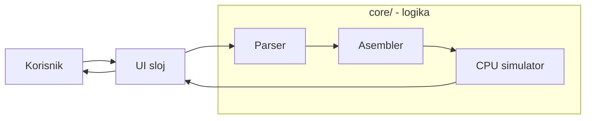
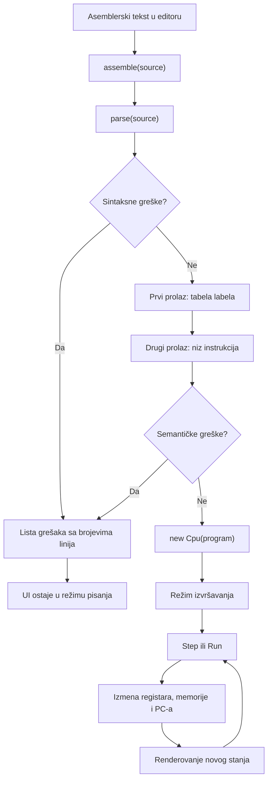
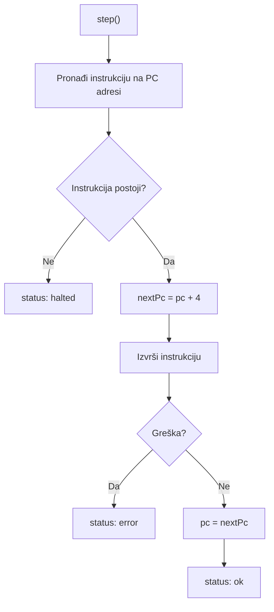
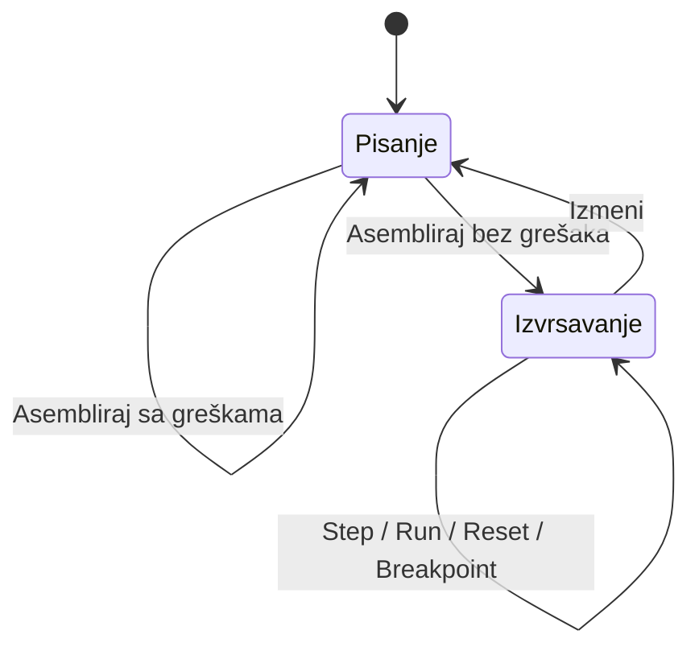

# 1. Arhitektura aplikacije

## Osnovna ideja

Aplikacija je podeljena na dva sloja:

- **core** sadrži parser, asembler i model procesora;
- **UI** povezuje korisničke kontrole sa core logikom i prikazuje trenutno stanje.

Najvažnija arhitektonska odluka je da `core/` ne zavisi od browsera. Ne koristi DOM,
HTML elemente ni događaje, pa se može testirati kao običan TypeScript kod.



## Komponente

| Komponenta | Fajl | Odgovornost |
|---|---|---|
| Zajednički tipovi | [`src/core/types.ts`](../../src/core/types.ts) | tipovi operanada, parsiranih linija i instrukcija |
| Parser | [`src/core/parser.ts`](../../src/core/parser.ts) | tekst pretvara u strukturirane linije i prijavljuje sintaksne greške |
| Asembler | [`src/core/assembler.ts`](../../src/core/assembler.ts) | proverava semantiku, prevodi pseudo-instrukcije i razrešava labele |
| CPU | [`src/core/cpu.ts`](../../src/core/cpu.ts) | čuva registre, memoriju i PC i izvršava instrukcije |
| UI kontroler | [`src/ui/main.ts`](../../src/ui/main.ts) | čuva stanje ekrana i reaguje na akcije korisnika |
| Iscrtavanje | [`src/ui/render.ts`](../../src/ui/render.ts) | prikazuje program, registre, memoriju i greške |
| Primer-programi | [`src/ui/examples.ts`](../../src/ui/examples.ts) | sadrži četiri programa dostupna iz padajućeg menija |
| Izgled | [`src/style.css`](../../src/style.css) | raspored, boje i vizuelna stanja elemenata |

## Glavni tok podataka



Tok je jednosmeran:

1. korisnik unosi tekst;
2. parser izdvaja strukturu;
3. asembler pravi izvršive instrukcije;
4. CPU menja svoje stanje;
5. UI čita stanje i ponovo ga prikazuje.

UI ne izvršava instrukcije, a CPU ne zna kako će stanje biti prikazano.

## Interna reprezentacija

### Parsirana linija

Parser za svaku nepraznu liniju pravi objekat približno ovog oblika:

```ts
{
  sourceLine: 7,
  label: "petlja",
  mnemonic: "ADDI",
  operands: [
    { kind: "reg", num: 1 },
    { kind: "reg", num: 1 },
    { kind: "imm", value: 1 }
  ]
}
```

Parser još ne proverava da li instrukcija postoji niti da li joj odgovaraju operandi.

### Asemblirana instrukcija

Asembler svaku pravu ili pseudo-instrukciju prevodi u jedinstven oblik:

```ts
{
  op: "ADDI",
  rd: 1,
  rs1: 1,
  rs2: 0,
  imm: 1,
  sourceLine: 7
}
```

Sva polja uvek postoje. Polja koja instrukcija ne koristi imaju vrednost nula. Zbog toga
CPU može jednostavno da pročita instrukciju i izvrši odgovarajuću granu `switch` naredbe.

Polje `sourceLine` povezuje instrukciju sa editorom i koristi se za marker `>`, greške i
breakpointe.

### Stanje procesora

```text
registri: Int32Array(32)
memorija: Uint8Array(4096)
PC:       adresa sledeće instrukcije u bajtovima
program:  niz asembliranih instrukcija
```

- registri su 32-bitni brojevi sa znakom;
- `x0` je uvek nula;
- memorija podataka ima 4 KB i little-endian raspored;
- instrukcije i podaci čuvaju se odvojeno;
- svaka instrukcija zauzima četiri bajta, pa je indeks instrukcije `PC / 4`.

## Tok jedne instrukcije



`pc` ostaje nepromenjen dok se instrukcija izvršava. Podrazumevana sledeća adresa čuva se
u `nextPc`, a grane i skokovi mogu da je promene. Tek po uspešnom završetku instrukcije
`nextPc` postaje novi `pc`.

Ovo je važno za `JAL` i `JALR`, jer se povratna adresa računa kao stari `pc + 4`.

## Tok UI-ja

UI ima dva režima:



U režimu pisanja aktivni su editor, izbor primera i dugme Asembliraj. U režimu izvršavanja
kod je zaključan i prikazuje se kao listing sa brojevima linija, markerom i breakpointima.

Posle svake akcije UI ponovo iscrtava relevantne panele iz trenutnog stanja. Pošto su
programi i paneli mali, potpuno ponovno iscrtavanje je jednostavnije i dovoljno brzo.

## Zašto je ovakva podela dobra

1. **Testabilnost** — parser, asembler i CPU testiraju se bez pokretanja browsera.
2. **Jasne odgovornosti** — svaki modul radi jednu vrstu posla.
3. **Lakše pronalaženje grešaka** — sintaksna, semantička, izvršna i UI greška pripadaju
   različitim slojevima.
4. **Prenosivost** — isti `core/` mogao bi da se poveže sa drugačijim web ili desktop UI-jem.
5. **Jednostavnija odbrana** — tok podataka može da se objasni redom, bez mešanja DOM koda
   sa pravilima RISC-V simulatora.

## Kratko usmeno objašnjenje

> Aplikacija je podeljena na core i UI sloj. Core je čist TypeScript i ne zavisi od
> browsera. Parser prvo pretvara tekst u strukturirane linije i prijavljuje sintaksne
> greške. Asembler zatim u dva prolaza gradi tabelu labela, proverava operande, prevodi
> pseudo-instrukcije i pravi niz instrukcija. Taj niz dobija klasa Cpu, koja čuva 32
> registra, 4 KB memorije i programski brojač. Metode Step i Run menjaju samo stanje
> procesora, a UI posle svake akcije čita to stanje i ponovo prikazuje program, registre i
> memoriju. Ovakva podela omogućila je da se sva važna logika testira nezavisno od browsera.

## Moguća pitanja

**Zašto UI ne poziva parser direktno, pa zatim asembler?**  
Javna funkcija `assemble()` sama poziva parser. UI treba da zna samo da tekst daje program
ili listu grešaka, dok unutrašnji koraci ostaju odgovornost core sloja.

**Zašto CPU dobija već pripremljen niz instrukcija?**  
CPU ne treba da razume tekstualnu sintaksu, labele ni pseudo-instrukcije. On izvršava samo
jednostavnu internu reprezentaciju pravih instrukcija.

**Zašto se stanje ne čuva u UI-ju?**  
Registri, memorija i PC pripadaju modelu procesora. UI ih samo prikazuje i zato ne može
slučajno da promeni pravila izvršavanja.

**Da li bi core mogao da se koristi bez ovog interfejsa?**  
Da. Pošto nema zavisnost od DOM-a, isti parser, asembler i CPU mogli bi da se koriste iz
komandne linije, drugog web interfejsa ili desktop aplikacije.
